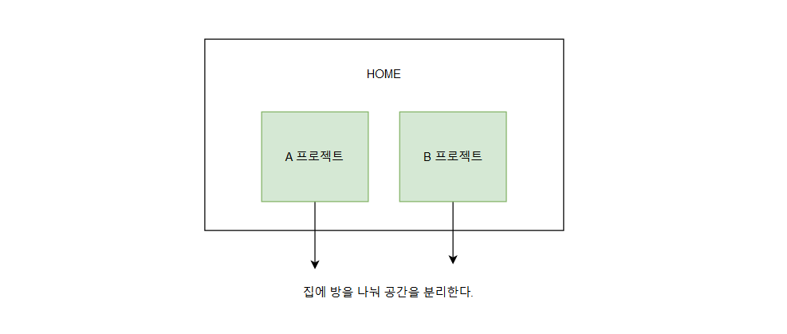
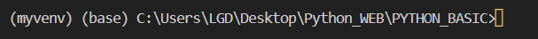
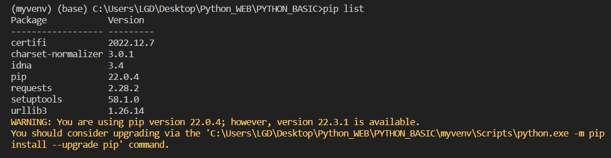

## 2_PYTHON 가상환경

##### ◼ 가상환경을 사용하는 이유 

> 
>
> * ##### 패키지 : 파이썬 소스 파일을 모아 놓은 것 


##### ◼ 가상환경 사용방법 

```
VENV
```


> 1. ##### myvenv 가상환경 설치 
>
>    ```
>    python -m venv myvenv
>    ```
>
>    * 📁 Scripts > activate
>
>      > activate :  가상환경 활성화, 가상환경 안으로 들어가겠다. 
>      >
>      > activate 활성화 
>      >
>      > ```
>      > myvenv\Scripts\activate
>      > ```
>      >
>      > 
>
>    * 📁 Scripts > deactivate 
>
>      > deactivate  : 가상환경에서 나오겠다. 
>
>    * 설치된 파일 보기 
>
>      ```'
>      pip list
>      ```
>
>      
>
> 2. ##### 다른 패키지 설치 
>
>    ```
>    pip install requests
>    ```
>
>    


