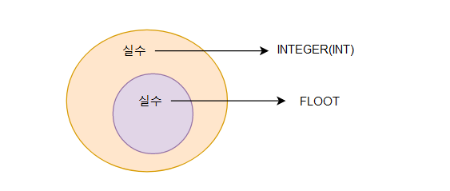

## 1_숫자, 문자, 불린형자료형

#### 🤔 프로그래밍이란? 

> * 프로그램을 만드는 일 
> * 문제해결을 하기 위해 만든다. 
>   * 전화 주문 시스템 => 온라인 주문 시스템 


#### ◼ 프로그래밍언어란? 

> * 프로그램을 만들기 위해 필요한 언어 
> * 프로그램을 만드는데 언어 공부까지 해야하나? 
>   * 외국어를 배우는 것과 비슷하다. 


---


#### 1. 자료형 

> 자료의 형태, 그렇다면 자료란? 자료는 DATA데이터 
>
> 이러한 데이터는 스마트폰만 봐도 엄청나게 많은 데이터 존재
>
> * 자료의 형태 = 자료의 종류


#### 2. 숫자형 

> * 숫자데이터, 정수형(소수점이 없는 숫자), 실수형(소수점이 있는 숫자)
>
>   


#### 3. 문자열

> 문자를 나열한 것 
>
> * " 큰따옴표 또는 ' 작은 따옴표 로 문자열의 시작과 끝을 나타냄 
>
>   ```python
>   "HO"
>   ```
>
>   ```PYTHON
>   'HO'
>   ```


#### 4. 불린형 

> 참 또는 거짓
>
> * True, False
>