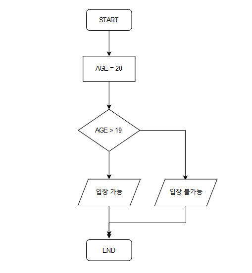
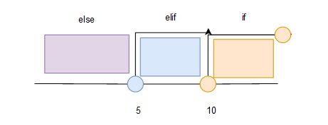

## 01_조건문 개념

> ##### ⭐⭐⭐⭐⭐ 가장 중요한 부분 ⭐⭐⭐⭐⭐


#### 제어문을 사용하는 이유 

> 프로그램은 기본적으로 위에서 아래로 순차적으로 실행 

#### ◼ 명령 A, B 중 한 개를 선택해 실행하고 싶거나 = 조건문 

#### ◼ 명령들을 반복해서 실행하고 싶을 때 = 반복문 


#### ◼ 조건문의 개념 

> 

##### ✔ IF 문 사용법 

> **기존** 비밀번호 = "1234"
>
> ```python
> origin_pass = "1234"
> ```
>
> **입력한** 비밀번호 = "1234"
>
> ```python
> input_pass = "1234"
> ```
>
> **만약** 비밀번호를 정확히 입력했으면 > 로그인 성공 
>
> ```python
> if origin_pass == input_pass:
> 	print("로그인 성공")
> ```


---


##### if, elif, else 범위 생각하기 

