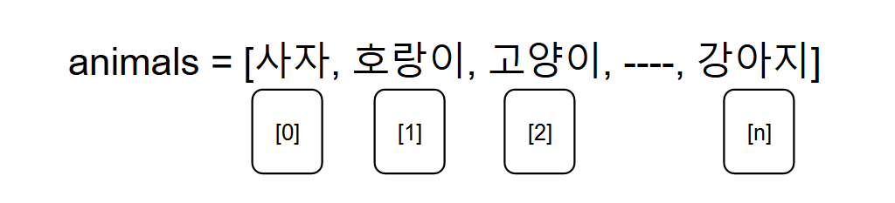

## 02_리스트 자료형

> ⭐⭐⭐⭐⭐


#### ◼ 리스트 사용하는 이유 

```
리스트명 = [데이터, 데이터, ---- , 데이터]
```

```
리스트명 = [ ]
```


#### ◼ 데이터 접근하기 





#### ◼ 데이터 조작하기 

> * 데이터 추가 
>
>   ```
>   리스트.append(데이터)
>   ```
>
>   ```python
>   # a = [1, 2, 3]
>   a.append(4) #[1, 2, 3, 4]
>   ```
>
>   
>
> * 데이터 할당 
>
>   ```
>   리스트[인덱스] = 데이터
>   ```
>
>   ```python
>   a[0] = 0
>   # [0, 2, 3, 4]
>   ```
>
>   
>
> * 데이터 삭제 
>
>   ```
>   del리스트[인덱스]
>   ```
>
>   ```python
>   del a[1]
>   # [0, 3, 4]
>   ```
>
> 
>
> * 슬라이싱 
>
>   ```
>   리스트[시작:끝 +1]
>   ```
>
>   ```python
>   b = [3, 4, 2, 1]
>   b[1:3]
>   #[4, 2]
>   ```
>
> 
>
> * 리스트 길이 
>
>   ```
>   len(리스트)
>   ```
>
>   ```python
>   len(b) 
>   #4
>   ```
>
> 
>
> * 리스트 정렬 
>
>   ```
>   리스트.sort()
>   ```
>
>   ```python
>   b.sort()
>   #오름차순으로 정리 
>   #[1, 2, 3, 4]
>   ```
>
>   


