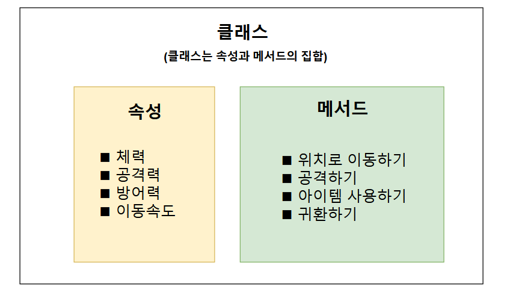

## 01_클래스와 객체 

#### ◼ 클래스 : 객체를 위한 설계도 _🍩빵틀

#### ◼ 객체 : 설계도로부터 만들어낸 제품_🍩만들어진 빵




```python
class 클래스 이름:
	def 메서드 이름:
		명령블록
```

```python
class Monster:
	def say(self):
		print("나는 몬스터이다")
```

> 정의된 클래스를 사용할 때는 다음과 같이 호출할 수 있다. 
>
> ```python
> 인스턴스 = 클래스 이름()
> 인스턴스.메서드()
> ```
>
> ```python
> goblin = Monster()
> goblin.say()
> ```

> * 인스턴스 = 객체 같은 말이다 
> * 인스턴스 : 보통 클래스와 연관지어서 표현하여 사용한다. 


#### 파이썬에서는 자료형도 클래스다. 

